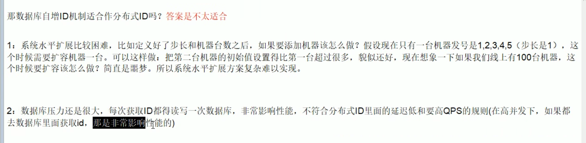
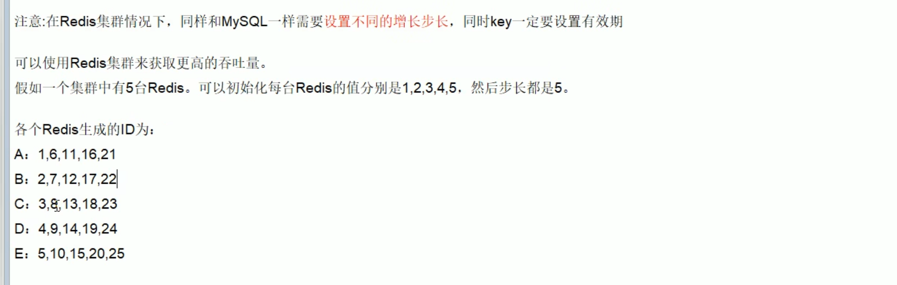
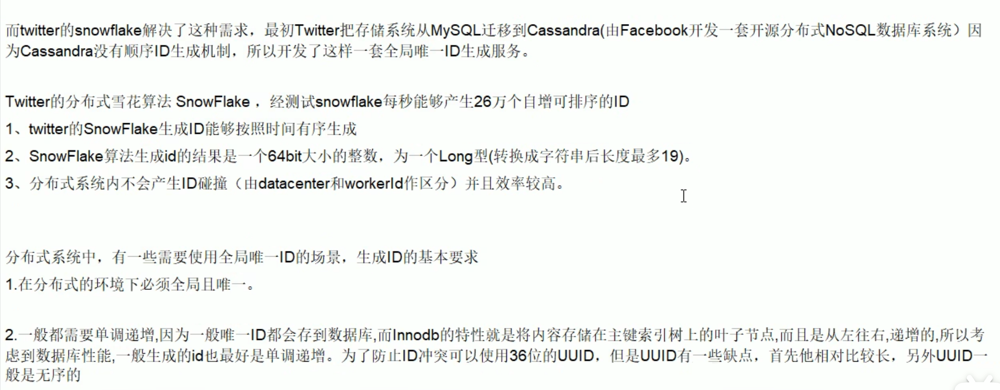
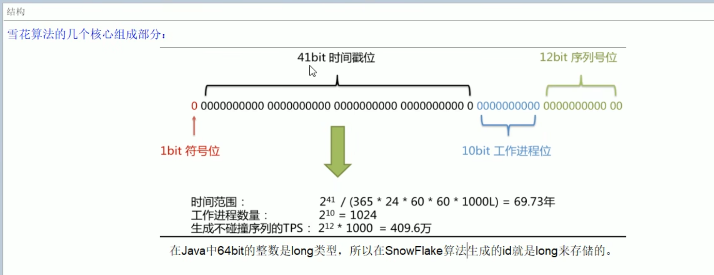
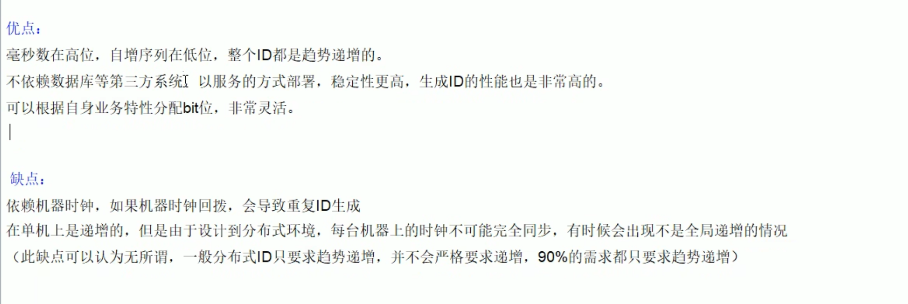

## 分布式ID算法
### 1. mysql数据库自增ID + replace into

特点：
- 优点：简单易用，数据库自带的自增ID机制。
- 缺点：高并发的环境下，自增ID的生成速度可能成为性能瓶颈。因为首先ID服务器要求高可用，这就要求多个数据库实例，而自增ID在多个实例之间是不唯一的。其次，如果需要将数据迁移到其他数据库，多台MySQL就可能会出现ID冲突的问题。
  

### 2. redis incr和incrby

特点：
- 优点：可以实现高可用和高并发，因为Redis是一个内存数据库，性能很高。同时，Redis的INCR命令是原子操作，可以保证ID的唯一性。
- 缺点：需要维护多个Redis服务器，这可能会增加系统的复杂度。而且如果某台Redis服务器出现故障，可能会导致ID不连续。


### 3. snowflake 雪花算法
**概述**


**结构**

字段说明：
- **符号位**：1位，固定为0(因为ID一般都是正整数，在二进制中，最高位是符号位，正数的符号位为0，负数的符号位为1)。
- **时间戳**：41位，精确到毫秒，可以表示69年的时间。
```angular2html
(2^41 - 1) / (1000 * 60 * 60 * 24 * 365) ≈ 69年。这里(2^41 - 1)表示正整数的取值范围从0开始算起，所以是 0到2^41-1 (0也是正整数)。
```
- **机器ID**：10位，可以表示1024个节点或者机器。2^10 = 1024。
```angular2html
该机器ID通常由数据中心ID和机器ID两部分组成，例如5位数据中心ID和5位机器ID，这样可以支持32(2^5)个数据中心和每个数据中心内的32(2^5)台机器。
5bit表示正整数的范围就是0到31，因为正整数的取值范围从0开始算起，所以可以用0、1、2、3、... 31来表示datacenterID和workerID。 
```
- **序列号**：12位，可以表示4096个ID。2^12 - 1 = 4096。
```angular2html
用来记录同一机器在相同毫秒内产生的不同ID。即可以用0、1、2、... 4095来表示序列号，来表示同一机器在相同毫秒内产生的4096个不同的ID。 
```


特点：
- 优点：可以生成全局唯一的ID，适用于高并发场景。Snowflake算法将时间戳、机器ID和序列号结合在一起，生成一个64位的唯一ID。
- 缺点：需要维护一个分布式环境，确保每个节点的机器ID是唯一的。此外，如果某个节点的时钟回拨，可能会导致ID冲突。
